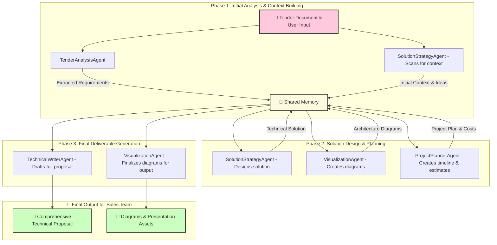
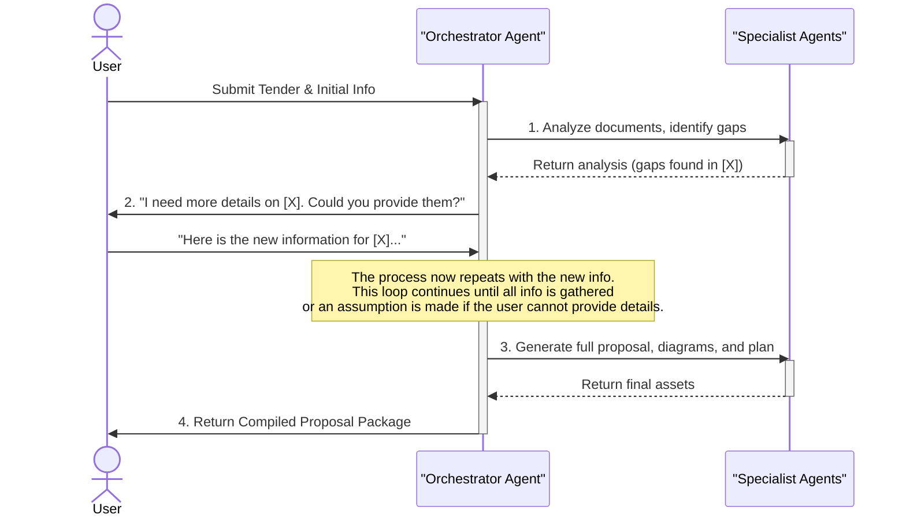

# AI Tech Consultant Agent - Draft Plan

## 1. The Idea

The **AI Tech Consultant Agent** is an advanced AI system designed to empower sales teams by automating the creation of high-quality, technically-sound proposals in response to tenders. It acts as a virtual solution architect, analyzing client requirements, suggesting innovative solutions based on our specific technology stack and partnerships, and generating all necessary documentation—from written proposals to architecture diagrams and project plans.

## 2. Pain Points Addressed

This agent directly tackles the following critical pain points:

*   **Technical Gap:** Sales teams lack the deep technical expertise to draft comprehensive proposals, leading to generic and uninspired submissions.
*   **Expert Bottleneck:** Senior technical staff (Solution Architects, Consultants) spend excessive time (1-2 hours per tender) reviewing basic proposals and re-capturing client requirements from scratch.
*   **Lack of Context:** Proposals are often drafted without a full understanding of the client's business, pain points, or existing workflows, leading to misaligned solutions.
*   **Poor Visualization:** The scope of work is often poorly defined, making it difficult for designers, developers, and project managers to understand the tasks and for the sales team to set clear expectations with the client.
*   **Inefficiency:** The current process is manual, time-consuming, and lacks a systematic way to leverage internal knowledge (e.g., Votee's tech stack, past project successes).

## 3. Proposed Solution: A Multi-Agent System

We propose building a sophisticated multi-agent system that orchestrates a team of specialized AI agents to deconstruct the tender, reason about the solution, and construct the proposal. This system will not just rephrase the tender but will actively provide technical insight, identify risks, and propose tailored, multi-tiered solutions. It will operate as an interactive partner, capable of asking clarifying questions and ingesting supplementary documents to enrich its understanding. **Furthermore, if crucial information cannot be provided, the system is designed to make reasonable, clearly-stated assumptions and proceed, ensuring that progress is not halted while keeping the user fully aware of any gaps.** By leveraging a knowledge base and a suite of powerful tools, it will significantly reduce manual effort and improve the quality and speed of our proposal process.

## 4. System Architecture & High-Level Flow

The AI Tech Consultant is architected as a team of specialized agents managed by a central `OrchestratorAgent`. The diagram below illustrates the relationship between these agents and how they collaborate by reading from and writing to a `Shared Memory` space (powered by Mem0). This phased approach ensures a structured and logical progression from analysis to final proposal.

## 5. Interactive Conversational Flow

While the architecture diagram shows *what* the agents do, the sequence diagram below shows *how* the `OrchestratorAgent` manages the process. It acts as the single point of contact for the user, handling all communication and delegating tasks to the specialist agents. The diagram shows one example pass of the information-gathering loop.

## 6. Agent Roles and Responsibilities

The system is composed of the following agents, managed by the Orchestrator:

*   **`OrchestratorAgent`**: The conductor of the entire process. It initializes the workflow, passes data between agents, and ensures all steps are completed in the correct order. Crucially, it **manages a continuous, interactive dialogue with the user, asking for clarification and additional documents** whenever the specialist agents identify missing information.

*   **`TenderAnalysisAgent`**:
    *   **Responsibility**: Ingests and meticulously analyzes tender documents and any supplementary information, **both at the start and during the conversation**.
    *   **Function**: Extracts requirements, constraints, client background, etc. If critical information is missing, it will flag these gaps for the Orchestrator to resolve with the user.
    *   **Tools**: Document parsing tools (PDF, DOCX), RAG-based search, and the ability to handle new file uploads during the process.

*   **`SolutionStrategyAgent`**:
    *   **Responsibility**: The core technical brain. It formulates a winning solution.
    *   **Function**: Takes the analysis from the `TenderAnalysisAgent` and brainstorms technical solutions. It considers client pain points, suggests approaches (low/medium/high cost), and selects the best technologies for the job.
    *   **Tools**: It will heavily use **Mem0** to `search_memories` about:
        *   Votee's internal technologies (ASR, TTS, Voice Agent, etc.).
        *   Partner capabilities and integrations (Sanuker, Deepbrain AI, etc.).
        *   Latest AI technology trends.
        *   Past successful project architectures.
*   **`TechnicalWriterAgent`**:
    *   **Responsibility**: Drafts the human-readable proposal document.
    *   **Function**: Weaves the structured output from the other agents into a coherent and persuasive narrative. It will generate the main proposal body, introductions, conclusions, and user guidelines.
    *   **Tools**: Document formatting and editing tools.
*   **`VisualizationAgent`**:
    *   **Responsibility**: Creates all necessary diagrams.
    *   **Function**: Generates visual aids to make the technical solution easier to understand.
    *   **Tools**: A tool to generate Mermaid syntax for:
        *   High-level architecture diagrams.
        *   Infrastructure diagrams.
        *   Workflow diagrams (e.g., Agile process).
*   **`ProjectPlannerAgent`**:
    *   **Responsibility**: Handles the project management aspects of the proposal.
    *   **Function**: Creates a draft project timeline, estimates workloads, compiles a hardware list with potential costs, and outlines the project phases.
    *   **Tools**: Timeline generation, cost estimation tools.

## 7. Technology Stack Integration

This project will be built on a modern, agent-focused technology stack as requested.

*   **@Agent Development Kit (ADK)**: We will use ADK to define each agent and its associated tools, following the best practices outlined in `024-ADK-with-Mem0.mdc`. The `` decorator will be used to create the specific capabilities for each agent.

*   **@Mem0**: This is the cornerstone of our system's knowledge and intelligence. We will use Mem0 to create a persistent, searchable knowledge base. The specialized agents will rely on it to move beyond generic LLM knowledge and provide solutions grounded in Votee's unique strengths and partnerships.

*   **@LiteLLM**: To ensure we are using the best model for each task and to maintain flexibility, LiteLLM will be implemented as a central proxy for all LLM calls. This allows us to route different tasks (e.g., complex reasoning vs. simple text summarization) to different models (e.g., GPT-4 vs. Haiku) to optimize for both cost and performance. It also helps in sourcing the right LLM for the client's solution as required.

*   **@LangFuse**: Observability is non-negotiable for a complex multi-agent system. LangFuse will be integrated from day one to trace the entire lifecycle of a proposal generation request. This will provide:
    *   **Traceability**: A clear, visual trace of the interactions between the Orchestrator and specialized agents.
    *   **Debugging**: Detailed logs of tool inputs/outputs and LLM calls to quickly identify and fix issues.
    *   **Evaluation**: The ability to evaluate the quality of outputs at each step, helping us to refine prompts and agent instructions over time.

## 8. Next Steps

1.  **Develop a Detailed Implementation Plan**: Break down the development of each agent into specific tasks and sprints, referencing the structure in `.cursor/rules/007-Implementation-Plan-Docs.mdc`.
2.  **Define Knowledge Base Schema**: Specify the data structures for the information we will store in Mem0 (e.g., how to represent a partner, a technology, or a past project).
3.  **Prototype the `TenderAnalysisAgent`**: Start with the first agent in the chain to build a solid foundation for data extraction.
4.  **Set Up the Core Infrastructure**: Initialize the project with ADK, LiteLLM, and LangFuse to ensure the framework is in place before building complex logic. 