# Backend Structure: AI Tech Consultant Agent

This document outlines the backend architecture for the AI Tech Consultant Agent, a multi-agent system built using the Google Agent Development Kit (ADK). It details the components, data flow, and core technical patterns.

## 1. Architecture Overview

The system is designed as a **hierarchical multi-agent system**. A central `OrchestratorAgent` manages a team of specialized agents, coordinating their execution in a phased approach to deconstruct a tender, design a solution, and generate a comprehensive proposal.

This architecture was chosen to promote modularity, separation of concerns, and specialized expertise. Each agent has a single responsibility, making the system easier to develop, test, and maintain. Communication and state are managed through a shared memory space, powered by Mem0.

### High-Level Diagram

```mermaid
graph TD
    subgraph "Orchestration Layer"
        Orchestrator[OrchestratorAgent]
    end

    subgraph "Specialist Agents"
        TenderAgent[TenderAnalysisAgent]
        SolutionAgent[SolutionStrategyAgent]
        WriterAgent[TechnicalWriterAgent]
        VizAgent[VisualizationAgent]
        PlannerAgent[ProjectPlannerAgent]
    end

    subgraph "Core Services & Data"
        SharedMemory["🧠 Shared Memory (Mem0)"]
        Tools["Tooling Layer"]
        LLMProxy["LLM Proxy (LiteLLM)"]
        Observability["Observability (LangFuse)"]
    end

    Orchestrator --> TenderAgent
    Orchestrator --> SolutionAgent
    Orchestrator --> WriterAgent
    Orchestrator --> VizAgent
    Orchestrator --> PlannerAgent

    TenderAgent -- "Reads/Writes" --> SharedMemory
    SolutionAgent -- "Reads/Writes" --> SharedMemory
    WriterAgent -- "Reads/Writes" --> SharedMemory
    VizAgent -- "Reads/Writes" --> SharedMemory
    PlannerAgent -- "Reads/Writes" --> SharedMemory
    
    TenderAgent --> Tools
    SolutionAgent --> Tools
    VizAgent --> Tools
    PlannerAgent --> Tools

    Orchestrator -- Manages --> LLMProxy
    LLMProxy -- Logs to --> Observability
```

## 2. Key Components / Services

The system is composed of several agents, each located in `src/agents/`.

*   **`OrchestratorAgent` (`orchestrator_agent.py`)**
    *   **Purpose**: Acts as the main controller and user interface for the system. It manages the overall workflow, delegates tasks to specialist agents, and handles the interactive dialogue with the user.
    *   **Core Responsibilities**:
        *   Initialize the shared memory space for a new tender.
        *   Execute specialist agents in a logical sequence (e.g., Analysis -> Strategy -> Planning -> Generation).
        *   Gather information gaps flagged by other agents and request clarification from the user.
        *   Assemble the final proposal from the artifacts created by other agents.
    *   **Dependencies**: All specialist agents.

*   **`TenderAnalysisAgent` (`tender_analysis_agent.py`)**
    *   **Purpose**: To ingest and understand the client's tender documents.
    *   **Core Responsibilities**:
        *   Parse input documents (PDF, DOCX).
        *   Extract key requirements, constraints, and client information.
        *   Identify and flag information gaps.
        *   Store structured analysis in the Shared Memory.
    *   **Dependencies**: Document Parsing Tools.

*   **`SolutionStrategyAgent` (`solution_strategy_agent.py`)**
    *   **Purpose**: To design the technical solution based on the tender analysis.
    *   **Core Responsibilities**:
        *   Search the knowledge base (Mem0) for relevant past projects, partner technologies, and internal capabilities.
        *   Brainstorm and define a technical solution, including potential low/medium/high cost options.
        *   Select the optimal technology stack for the proposed solution.
        *   Write the solution design to Shared Memory.
    *   **Dependencies**: Memory Tools (Mem0).

*   **`TechnicalWriterAgent` (`technical_writer_agent.py`)**
    *   **Purpose**: To draft the final, human-readable proposal document.
    *   **Core Responsibilities**:
        *   Read all structured data from Shared Memory (analysis, solution, project plan).
        *   Weave the information into a coherent and persuasive narrative.
        *   Generate the final proposal document.
    *   **Dependencies**: Shared Memory.

*   **`VisualizationAgent` (`visualization_agent.py`)**
    *   **Purpose**: To create diagrams and visual aids.
    *   **Core Responsibilities**:
        *   Generate Mermaid syntax for architecture, infrastructure, and workflow diagrams based on the solution design.
        *   Store diagrams as artifacts in Shared Memory.
    *   **Dependencies**: Diagram Generation Tools.

*   **`ProjectPlannerAgent` (`project_planner_agent.py`)**
    *   **Purpose**: To create project timelines and estimate costs.
    *   **Core Responsibilities**:
        *   Generate a draft project timeline based on the solution.
        *   Estimate workloads and outline project phases.
        *   Compile a list of hardware/software requirements and potential costs.
        *   Write the plan to Shared Memory.
    *   **Dependencies**: Planning Tools.

## 3. Database Schema (Shared Memory)

The system does not use a traditional relational or NoSQL database for transactional data. Instead, it relies on **Mem0** as a persistent, searchable knowledge base and a session-based shared memory space.

*   **Technology**: [Mem0](https://mem0.ai)
*   **Path**: `src/core/shared_memory.py` will contain the client initialization and helper functions.
*   **Schema**: The "schema" is unstructured and dynamic, managed by the agents. Data is stored as memories associated with a specific `user_id` and `session_id`. Key information stored includes:
    *   Extracted tender requirements.
    *   Proposed technical solution.
    *   Architecture diagrams (as Mermaid text).
    *   Project plan details.
    *   User clarifications.
*   **Knowledge Base**: A separate Mem0 instance (or a shared user) will be used to store long-term knowledge about Votee's technologies, partners, and past projects. The `SolutionStrategyAgent` will primarily use this for research.

## 4. API Design (Inter-Agent Communication)

There is no external-facing REST or GraphQL API. The "API" of this system is defined by the tools and state management that enable inter-agent communication.

*   **Communication Style**: Asynchronous, state-driven communication. Agents operate independently and communicate by reading from and writing to the central `SharedMemory` (Mem0).
*   **Tooling Layer (`src/tools/`)**: Tools are the primary mechanism for agents to interact with the outside world and each other's work. They are designed as simple, single-purpose functions decorated with ADK's ``.
    *   **`memory_tools.py`**: `save_memory`, `search_memories`. Used by all agents to interact with Mem0.
    *   **`document_parsing_tools.py`**: `parse_pdf`, `parse_docx`. Used by `TenderAnalysisAgent`.
    *   **`diagram_tools.py`**: `create_architecture_diagram`. Used by `VisualizationAgent`.
    *   **`planning_tools.py`**: `generate_timeline`. Used by `ProjectPlannerAgent`.

## 5. Error Handling Strategy

*   **Agent Failures**: The `OrchestratorAgent` is responsible for catching exceptions from specialist agents. If an agent fails, the Orchestrator will log the error (via LangFuse) and can either halt the process or attempt a retry.
*   **Tool Failures**: Individual tools will be wrapped in `try...except` blocks to handle external API errors (e.g., Mem0 or Google API issues). A failing tool should return a clear error status in its output dictionary, which the calling agent can then reason about.
*   **Observability**: LangFuse is integrated at the core (`src/core/config.py`) to provide detailed traces of all agent and tool executions. This is the primary mechanism for debugging and monitoring for unexpected behavior.

## 6. Background Job Processing

Long-running tasks, such as analyzing a very large tender document or performing extensive research, will be implemented using ADK's `LongRunningFunctionTool`. This allows the tool to yield intermediate progress updates back to the Orchestrator and user, preventing the system from appearing frozen.

## 7. Security Considerations

*   **API Key Management**: All API keys and sensitive credentials (Google, Mem0, LangFuse) will be managed via environment variables, loaded from a `.env` file using `python-dotenv`. The `.env` file itself will not be committed to source control. An `.env.example` file serves as a template.
*   **Data Privacy**: The system will handle potentially sensitive client data from tenders. All data stored in Mem0 will be associated with a specific session and user. Access controls within Mem0 will be relied upon to ensure data isolation. We must be mindful of not leaking PII into logs or overly broad memory searches.
*   **Input Validation**: The `TenderAnalysisAgent` is the primary entry point for external data. While the scope is limited to document parsing, care will be taken to use robust libraries that are not vulnerable to exploits in file format parsing. 