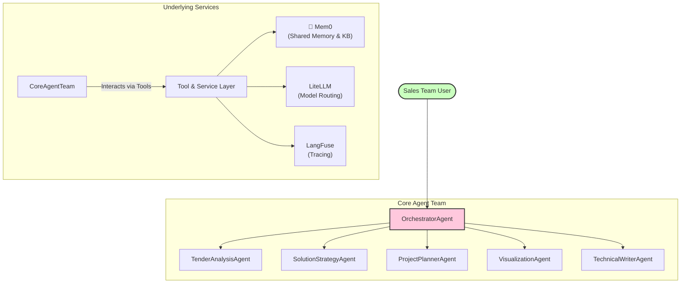
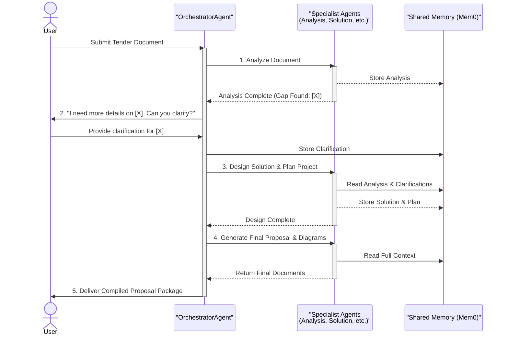

# Technical Overview: AI Tech Consultant Agent

## 1. Introduction & Purpose

This document provides a technical overview of the AI Tech Consultant Agent. It is intended for developers, technical leads, and AI assistants to understand the system's architecture, technology stack, and core operational flows.

The purpose of this agent is to automate the creation of high-quality technical proposals in response to tenders. It functions as a virtual solution architect, analyzing client requirements, designing solutions using a predefined knowledge base, and generating all necessary documentation.

## 2. Technology Stack Summary

*   **Agent Framework**: [Google Agent Development Kit (ADK)](https://developers.google.com/build/agents/adk)
*   **Language**: Python
*   **LLM Abstraction**: [LiteLLM](https://litellm.ai/)
*   **Memory & Knowledge Base**: [Mem0](https://mem0.ai)
*   **Observability & Tracing**: [LangFuse](https://langfuse.com/)
*   **Environment Management**: `python-dotenv`

## 3. System Architecture

The system is architected as a hierarchical team of specialized agents managed by a central `OrchestratorAgent`. This design promotes modularity and separation of concerns.



## 4. Core Workflows / Process Flows

The primary workflow is the generation of a proposal, managed by the `OrchestratorAgent`. This process is interactive, allowing the agent to ask for clarification if needed.

### Proposal Generation Sequence



## 5. Technical Components Breakdown

The core logic is contained within the `src/` directory.

*   **`src/agents/`**: Contains the definition for each specialist agent.
    *   `orchestrator_agent.py`: The main control loop.
    *   `tender_analysis_agent.py`: Handles input document processing.
    *   `solution_strategy_agent.py`: The core "brain" that designs the solution.
    *   *etc.*
*   **`src/tools/`**: Holds the tools that agents use to perform actions.
    *   `memory_tools.py`: Wrappers for interacting with the Mem0 client.
    *   `diagram_tools.py`: Functions to generate Mermaid syntax.
*   **`src/core/`**: Application-wide utilities.
    *   `config.py`: Handles environment variables and initialization of clients (LangFuse).
    *   `shared_memory.py`: Will contain the Mem0 client setup.
*   **`main.py`**: The entry point for running the agent application.

## 6. Data Flow

Data flows between agents via a shared memory space managed by Mem0. Agents do not call each other directly; they read and write to this central store, which is orchestrated by the `OrchestratorAgent`.

A typical data write operation involves an agent calling a tool (e.g., `save_memory`), which in turn calls the Mem0 client to persist a piece of information tagged to the current session.

## 7. Key Implementation Details & Architectural Decisions

*   **Model Abstraction with LiteLLM**: All LLM calls will be routed through LiteLLM. This allows us to be model-agnostic and easily switch between different providers (e.g., Google, OpenAI, Anthropic) for different tasks to optimize cost and performance. The configuration will be managed in `src/core/config.py`.
*   **Comprehensive Observability with LangFuse**: To enable robust debugging and performance monitoring in a complex multi-agent system, LangFuse is integrated at the start. It will automatically trace all ADK agent and tool executions via its OpenTelemetry compatibility, providing a clear view of the entire proposal generation lifecycle.
*   **Stateful Interaction via Mem0**: Unlike a stateless chatbot, this system is deeply stateful. Mem0 provides both the short-term "scratchpad" for agents to collaborate on a single proposal and the long-term, searchable knowledge base required by the `SolutionStrategyAgent` to produce contextually relevant and technically sound solutions.

## 8. Development & Testing

### Setup
1.  Clone the repository.
2.  Create a Python virtual environment: `python -m venv .venv && source .venv/bin/activate`
3.  Install dependencies: `pip install -r requirements.txt`
4.  Copy `.env.example` to `.env` and populate it with your API keys for Google, Mem0, and LangFuse.

### Running the Application
The main entry point will be `src/main.py`.
```bash
python src/main.py
```

### Testing
Unit tests for tools and agents will be located in the `tests/` directory and can be run using `pytest`.
```bash
pytest
``` 